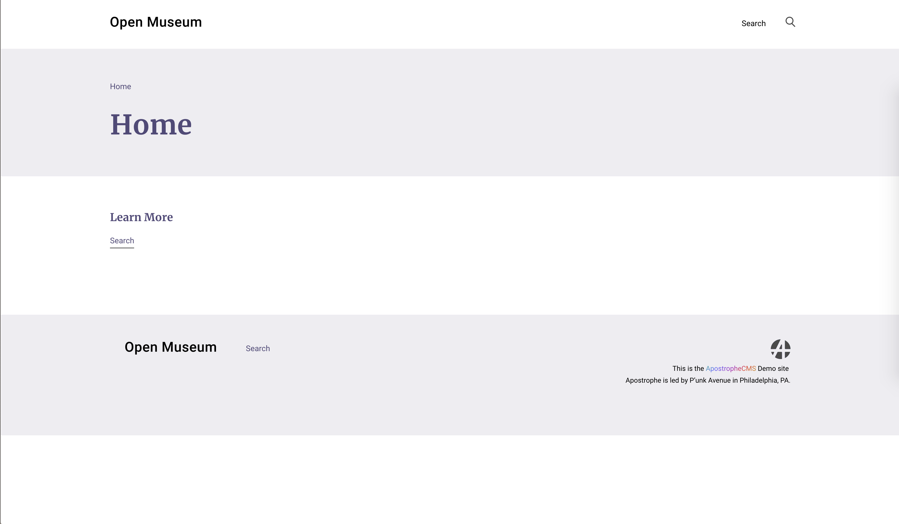

# Creating Your Project


  If you haven't yet, you'll need to set up your local environment to to get Apostrophe up an running. See the [Setting up your Environment tutorial](https://docs.apostrophecms.org/apostrophe/tutorials/getting-started/setting-up-your-environment) before you attempt to recreate Open Museum. You'll also need to install `apostrophe-cli` globally.


Once you have `apostrophe-cli` installed you can run the following command to spin up a new sandbox using the Open Museum repository.

`apostrophe create-project --boilerplate https://github.com/apostrophecms/apostrophe-open-museum MY-NEW-WEBSITE`


  This will start your project out with a `shortName` of `apostrophe-open-museum`. This will become the database name, among other things. If you want to change it, edit the `shortName` value in `app.js` _before_ going to the next step.


This will create a directory with the given project name. You'll want to change to this directory and install node modules.

```
cd MY-NEW-WEBSITE
npm install
```

After installing the modules we want to get our database set up with a new admin user.

```
node app apostrophe-users:add USERNAME admin
```

When prompted, enter a password for this user.

After you've entered a password, start your apostrophe app with 

```
node app
```

Now navigating to [http://localhost:3000](http://localhost:3000) should show an empty Open Museum site.



Next, we'll create a home page and add widgets to it.