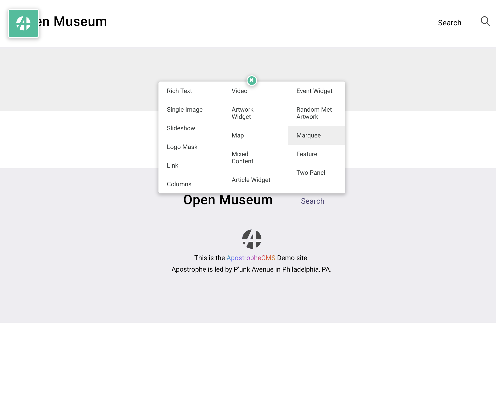

# The Home Page

When first installed, Open Museum's home page will have it's own page template, separate from the default page template, but the design of site is such that this separation is not neccessary -- the home page can be built with the same component set as, say, the About Us page.

In Open Museum, the default page type has extra options and settings that the home page will want to leverage, so right away we'll want to change the home page's Page Type to default.

- Go to [http://localhost:3000/login](http://localhost:3000/login) and enter the credentials you created [when you created the project](01-create-your-project.md).
- From the *Page Menu* choose *Page Settings*.
- Change the Type from _Home_ to _Default_
- Save

You will now get a full width area with the ability to add a large marquee, and other widgets found on the demo home page

[More info about how the default page works at it's tutorial](04-new-default-page-type.md)