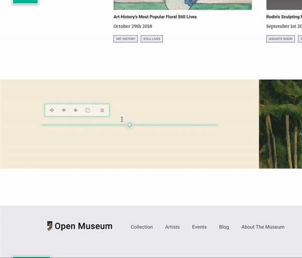

# Customize the Richtext Widget options

Throughout the website will be rich text widgets where editors can enter, edit, and style text content.

 As a refresher, putting a rich text singleton in a template is as simple as:

```markup
{{ apos.singleton(context, 'widgetName', 'apostrophe-rich-text', options ) }}
```

For in-depth coverage of `apostrophe-rich-text`’s options, see [Adding editable content to pages](https://docs.apostrophecms.org/apostrophe/tutorials/getting-started/adding-editable-content-to-pages#apostrophe-rich-text)

## Configuring rich text with tools and classes

We want to specify tools for our editors to use and classes to wrap the resulting markup. Our default rich text configuration in Open Museum looks like:

```javascript
{{ apos.singleton(context, 'widgetName', 'apostrophe-rich-text', {
  toolbar: [ 'Styles', 'Bold', 'Italic', 'Blockquote', 'Link', 'Anchor', 'Unlink', 'NumberedList', 'BulletedList' ],
  styles: [
    { name: 'Body Copy (P)', element: 'p', attributes: { class: 'o-body' } },
    { name: 'Section Header (H2)', element: 'h2', attributes: { class: 'o-section-header' } },
    { name: 'Headline (H3)', element: 'h3', attributes: { class: 'o-headline' } },
    { name: 'Sub Headline (H4)', element: 'h4', attributes: { class: 'o-subheadline' } },
    { name: 'Meta (P)', element: 'p', attributes: { class: 'o-meta' } }
  ]
} ) }}
```

### Toolbar

Enable the rich text Styles UI, which lets editors apply hierarchy and markup to their content, as well as controls for creating links, bold/italic text, lists, and quotes. A full list of possible tools is at [Adding editable content to pages](https://docs.apostrophecms.org/apostrophe/tutorials/getting-started/adding-editable-content-to-pages#toolbar)

### Styles

Specify what markup will be available to the editor and what HTML classes will be applied to that markup.



## Configuring the sanitization


Above will get us visual styling at time of editing, but when refreshed will be formatted back to plaintext. This is because Apostrophe sanitizes the rich text on the server, stripping out anything not explicitly white listed.


Apostrophe leverages `sanitize-html` to do this, full documentation at [sanitize-html](https://github.com/punkave/sanitize-html) on Github.

**To white list our markup**



```javascript
module.exports = {
  sanitizeHtml: {
    allowedClasses: {
      'p': ['o-body', 'o-meta'],
      'h2': ['o-section-header'],
      'h3': ['o-headline'],
      'h4': ['o-subheadline']
    },
    allowedTags: [
      'h2', 'h3', 'h4', 'p', 'a', 'ul', 'ol', 'li', 'strong', 'em', 'blockquote'
    ],
    allowedSchemes: ['http', 'https', 'ftp', 'mailto', 'tel']
  }
};
```



After configuring this Open Museum will save the application of these styles, tags, etc.

